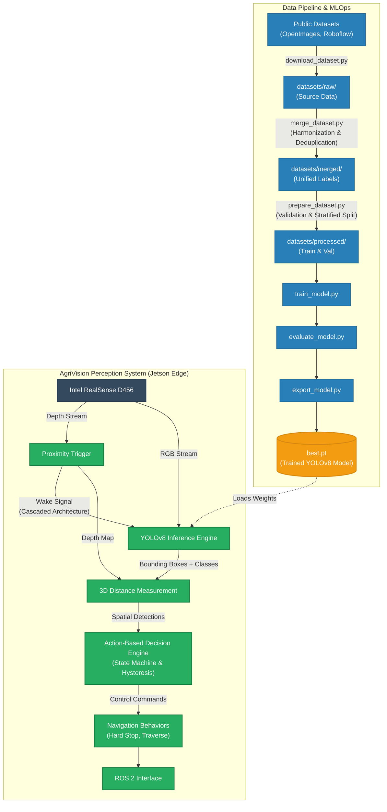

# AgriVision Perception System 

A production-ready, real-time AI perception system engineered for autonomous agricultural robots. This system integrates an Intel RealSense D456 depth camera with a custom-trained YOLOv8 Nano model to detect agricultural obstacles in unstructured farm environments and provide precise 3D distance measurements for safe navigation.

[]()
[]()
[]()
[]()

---

## 🏆 Key Achievements

- **Accuracy**: Fine-tuned a custom YOLOv8 Nano model achieving an impressive **71.9% mAP50** across 14 agricultural obstacle classes.
- **Edge Performance**: Maintained a real-time inference speed of **24 FPS** on CPU-only edge hardware (Intel RealSense RGB-D streams via OpenCV).
- **Automated MLOps**: Engineered an automated ingestion pipeline that successfully aggregated, deduplicated (SHA256), and harmonized over **14,500+** images from OpenImages and Roboflow.
- **System Decoupling**: Architected a configuration-driven inference engine, allowing seamless integration into the robotics team's **ROS 2** stack.

---

## 🏗️ System Architecture

The project is split into two robust domains: an automated MLOps data pipeline for continuous model improvement, and an optimized edge inference system for live robot deployment.



---

## 🛠️ Core Engineering Features

- **Cascaded Proximity-Triggered Architecture**: Optimized for edge deployment (e.g., NVIDIA Jetson) by using the RealSense depth stream as a gatekeeper. It wakes the YOLO inference engine only when obstacles are near, conserving critical CPU/GPU compute.
- **Action-Based Decision Engine**: Implements state-machine logic and hysteresis for stable control, translating volatile spatial detections into smooth, precise ROS 2 navigation commands (e.g., executing a hard stop exactly 1.5m from a tree).
- **Automated MLOps Pipeline**: A scalable, asynchronous, multi-provider dataset ingestion pipeline built entirely in Python. Automatically handles SHA256 image deduplication, chaotic label harmonization, and robust train/val stratified splits.
- **Strictly Configuration-Driven**: Zero hardcoded logic. Every aspect of the pipeline (from camera settings and class mappings to obstacle navigation behaviors) is controlled via centralized YAML files.

---

## 🚀 Quick Start Guide

### 1. Installation

```bash
# Clone the repository
git clone https://github.com/SarveeshK/Agri-robot-perception-system.git
cd Agri-robot-perception-system

# Install core dependencies (PyTorch, Ultralytics, OpenCV)
pip install -r requirements.txt

# Install Intel RealSense SDK and optional dataset providers
pip install pyrealsense2 openimages roboflow kaggle
```

---

## 📊 Running the Pipeline (End-to-End)

The pipeline is designed to be fully reproducible with a few simple commands.

### Phase 1: MLOps / Dataset Build
Downloads raw data from all providers, deduplicates images, unifies labels, and prepares the 80/20 splits.

```bash
python scripts/build_dataset.py
python scripts/audit_dataset.py
python scripts/freeze_dataset.py
```

### Phase 2: Model Training
Trains the YOLOv8 Nano model on the latest dataset release, strictly bound to CPU memory limits to prevent out-of-memory errors on edge devices.

```bash
LATEST_RELEASE=$(ls -td datasets/releases/* | head -1)
python scripts/train_model.py --data $LATEST_RELEASE/data.yaml --epochs 100
```

### Phase 3: Edge Inference & Testing (Live)
Run these tools directly on the robot (or your laptop) to validate real-time inference speeds and test the Intel RealSense integration.

```bash
# 1. Hardware Benchmarking: Tests maximum CPU FPS with rendering disabled
python scripts/stress_test.py

# 2. Live RGB-D Inference: Native Intel RealSense YOLOv8 demo
python scripts/realsense_demo.py
```

---

## 🗂️ Configuration & Ontology

The system tracks 14 agricultural obstacle classes. Below is a core sample of how classes map to navigation behavior. All logic is contained in `config/class_mapping.yaml` and `config/obstacle_properties.yaml`.

| Detection Class | Navigation Behavior |
|---|---|
| **Tree** | Hard stop at 1.5 m |
| **Stump** | Hard stop at 1.0 m |
| **Rock** | Hard stop at 1.2 m |
| **Small_Stone** | Conditional (size-based) |
| **Weed** | Traversable |
| **Bush** | Hard stop at 1.0 m |
| **Fence** | Hard stop at 2.0 m |
| **Human** | Hard stop / Safety Protocol |
*(Note: Complete list of all 14 classes available in the configuration registry).*

---

## 📁 Repository Structure

```text
Agri-robot-perception-system/
├── config/                   # All configuration — no hardcoded values
│   ├── class_mapping.yaml    # Canonical classes + provider label mappings
│   ├── obstacle_properties.yaml  # Navigation behavior per class
│   └── dataset_sources.yaml  # Dataset provider registry
├── datasets/
│   ├── raw/                  # Downloaded datasets (per provider)
│   ├── merged/               # Harmonized + deduplicated dataset
│   └── processed/            # Train/val split ready for training
├── models/                   # Pretrained weights and exports
├── scripts/                  # MLOps pipeline & benchmarking
│   ├── download_dataset.py   # Provider dispatcher
│   ├── merge_dataset.py      # Label harmonization
│   ├── train_model.py        # YOLOv8 Trainer
│   ├── realsense_demo.py     # Live Edge SDK Integration
│   └── stress_test.py        # Headless FPS Benchmarking
└── src/                      # Real-time inference engine (Phase 1)
```
